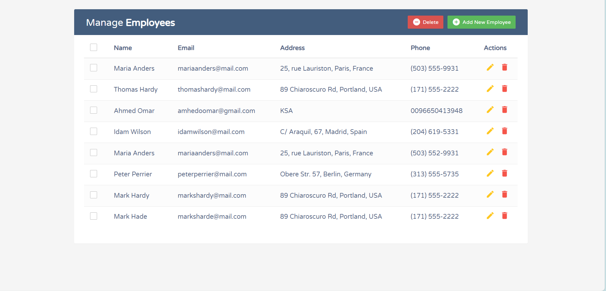
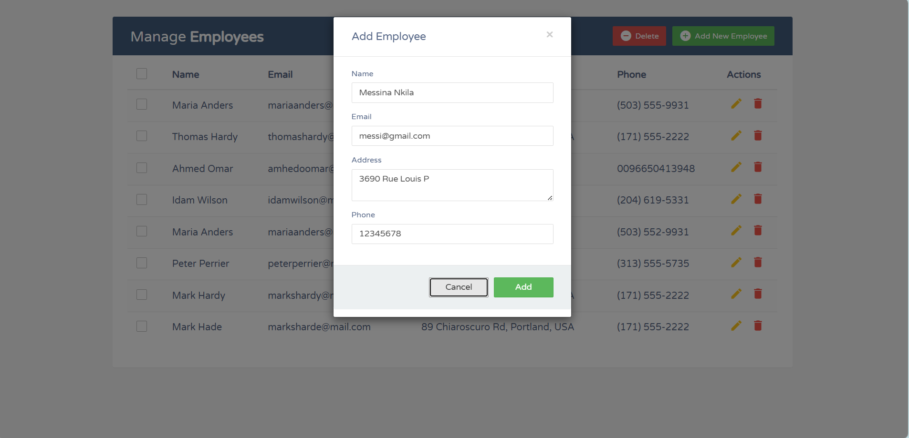
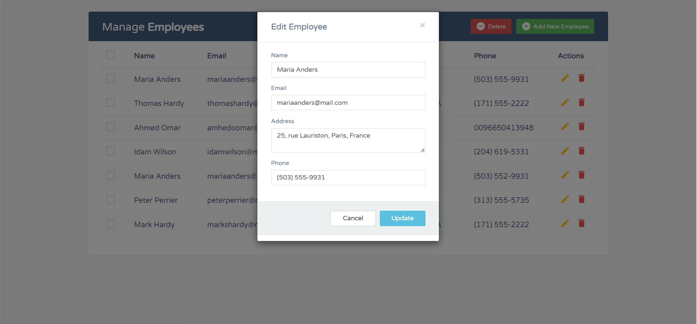
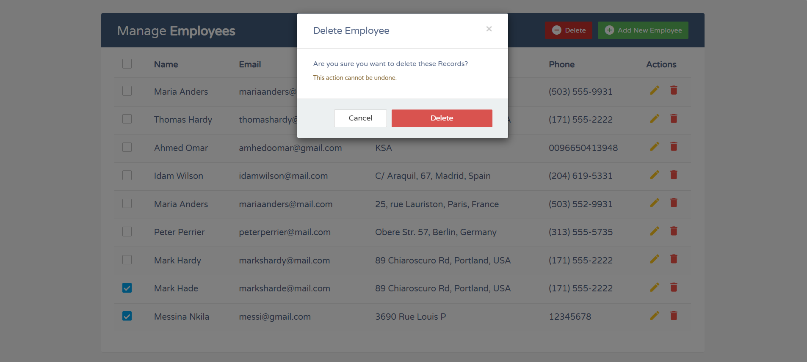

# Application CRUD Employés

Application web Java développée dans le cadre d’un apprentissage des technologies Servlet, JSP et JDBC en architecture MVC.

---

##  Description du projet

Cette application permet la gestion complète des employés (CRUD) :

-  Affichage de la liste des employés
-  Ajout d’un nouvel employé
-  Modification des informations d’un employé
-  Suppression d’un ou plusieurs employés
-  Récupération des données en JSON via AJAX

L’application suit une architecture MVC (Model - View - Controller) et utilise une base de données relationnelle (MySQL).

---

##  Architecture

L’application est structurée selon le modèle MVC :

###  Model
- `Employee`
- `EmployeeDAO`
- `EmployeeDAOImpl`

Gestion des accès à la base de données via JDBC et PreparedStatement.

###  View
- JSP
- JSTL
- Bootstrap
- AngularJS
- jQuery (AJAX)

###  Controller
- `EmployeeController`
- Gestion des routes :
    - `/employee/list`
    - `/employee/insert`
    - `/employee/update`
    - `/employee/delete`
    - `/employee/get`

---

## 🛠️ Technologies utilisées

- Java 8+
- Servlet API
- JSP / JSTL
- JDBC
- MySQL
- Apache Tomcat
- Bootstrap 3
- jQuery
- AngularJS
- IntelliJ IDEA

---

##  Fonctionnement

L'application repose sur :

- Un contrôleur unique (`/employee/*`)
- Des appels AJAX pour récupérer les données en JSON
- Des formulaires POST pour insert / update / delete
- Une gestion dynamique du DOM via AngularJS
- Une séparation claire des responsabilités (MVC)

---

##  Base de données

Exemple de structure SQL :

```sql
CREATE TABLE employee (
    id INT PRIMARY KEY AUTO_INCREMENT,
    name VARCHAR(100),
    address VARCHAR(255),
    email VARCHAR(100),
    phone VARCHAR(20)
);
```
## Objectif pédagogique

Ce projet m’a permis de développer et consolider les compétences suivantes :

- Compréhension du cycle de vie d’une Servlet
- Implémentation complète d’une architecture MVC
- Manipulation de JDBC et des PreparedStatement
- Gestion des requêtes AJAX et du format JSON
- Structuration d’une application web Java selon de bonnes pratiques

---
## 📷 Captures d’écran

### 🔹 Liste des employés
Affichage du tableau principal avec l’ensemble des employés enregistrés.



---

### 🔹 Ajout d’un employé
Formulaire modal permettant l’ajout d’un nouvel employé.



---

### 🔹 Modification d’un employé
Récupération dynamique des informations via AJAX et pré-remplissage du formulaire.



---

### 🔹 Suppression d’employés
Sélection multiple et suppression via requête POST.



---

## Auteur

**Michel Larry Evra Anaba Ngoum**  
Étudiant en Baccalauréat en Informatique  
Université du Québec à Trois-Rivières (UQTR)  
Spécialisation : Développement d’applications web et mobiles


